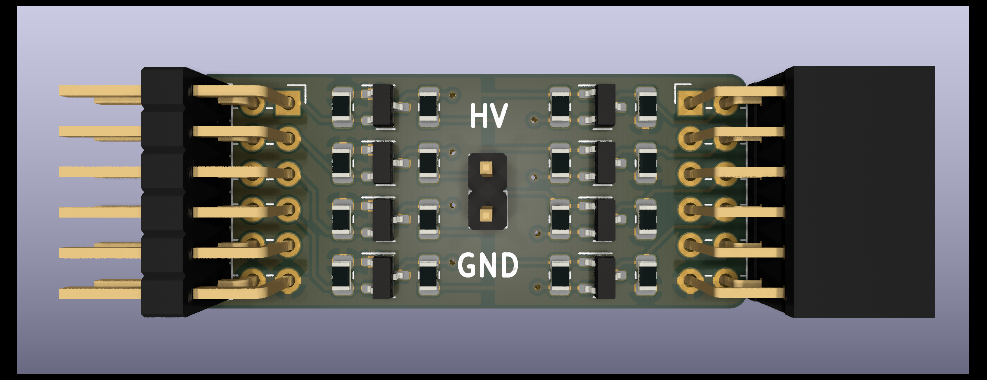
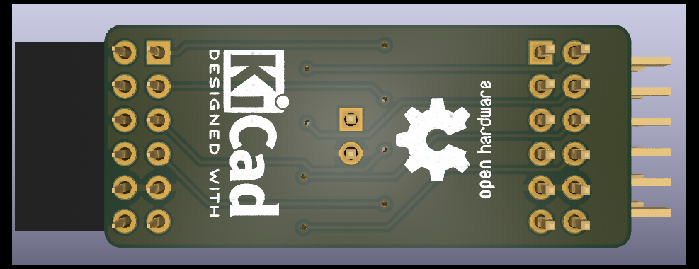

# pmod-levelshifter
A bidirectional levelshifter designed in KiCad to control higher voltages on an FPGA.

I designed this board to interface a keyboard over a PS/2 port. The logic level of the keyboard is 5V whereas the FPGAs IOs run at 3.3V. The `pmod-levelshifter` relays a signal from the HV side to the LV side and vice versa. When no side is driven, the lines are pulled high. 8 IOs are supported.

# Screenshots

